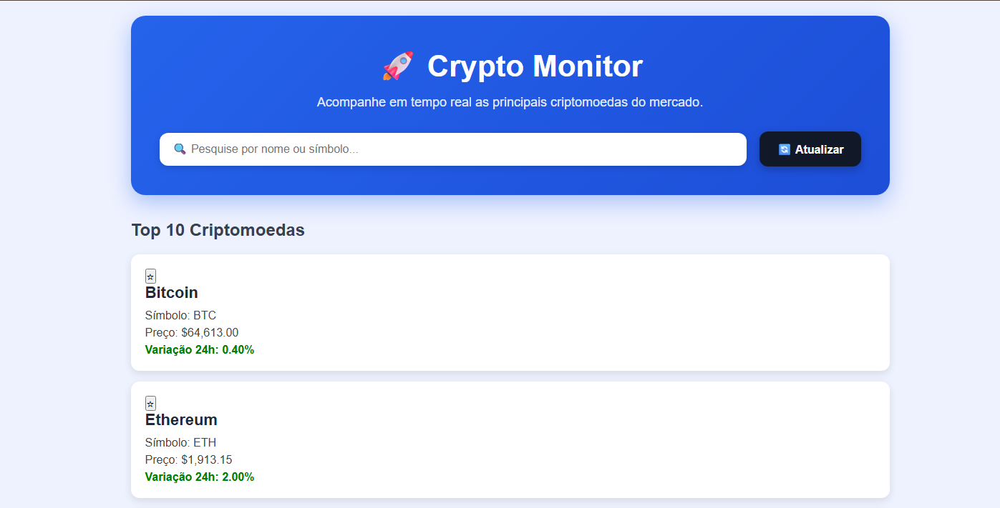
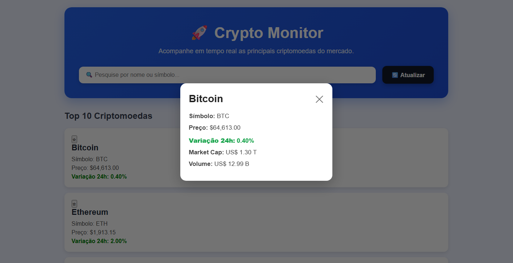

# 🚀 Crypto Monitor

Um painel de monitoramento de criptomoedas desenvolvido em **React + TypeScript**, que consome dados em tempo real da API pública da **CoinGecko**.

O projeto foi desenvolvido como parte de um desafio técnico para uma vaga de **Desenvolvedor Front-end**, tendo como foco boas práticas de desenvolvimento, componentização, consumo de APIs REST e organização de código.

## 🌐 Aplicação Online

**Acesse o projeto:**

https://portal-de-monitoramento-de-criptoat.vercel.app

---

# 📸 Screenshots

## Dashboard



---

## Detalhes da Criptomoeda



---

# ✨ Funcionalidades

- ✅ Listagem das 10 principais criptomoedas
- ✅ Nome e símbolo
- ✅ Preço atual em dólar (USD)
- ✅ Variação percentual das últimas 24 horas
- ✅ Busca em tempo real por nome ou símbolo
- ✅ Atualização manual dos dados
- ✅ Modal com detalhes da criptomoeda
- ✅ Sistema de favoritos
- ✅ Persistência dos favoritos utilizando Local Storage
- ✅ Tratamento de erros da API
- ✅ Indicador de carregamento (Loading)
- ✅ Interface responsiva

---

# 🛠 Tecnologias utilizadas

- React 18
- TypeScript
- Vite
- Axios
- CSS Modules
- CoinGecko API
- Local Storage
- HTML5
- CSS3

---

# 📂 Estrutura do Projeto

```text
src
│
├── components
│   ├── Button
│   ├── CryptoCard
│   ├── CryptoModal
│   ├── FavoriteButton
│   ├── Header
│   └── SearchBar
│
├── hooks
│   ├── useCrypto.ts
│   └── useFavorites.ts
│
├── pages
│   └── Dashboard.tsx
│
├── services
│   ├── api.ts
│   └── cryptoService.ts
│
├── types
│   └── crypto.ts
│
├── utils
│   ├── format.ts
│   └── storage.ts
│
├── App.tsx
├── main.tsx
└── index.css
```

---

# 🌐 API Utilizada

O projeto utiliza a API pública da **CoinGecko** para obter informações atualizadas das criptomoedas.

**Documentação oficial:**

https://www.coingecko.com/en/api/documentation

---

# ▶️ Como executar o projeto localmente

## 1 - Clone o repositório

```bash
git clone https://github.com/marciodutra/Portal-de-Monitoramento-de-Criptoativos.git
```

---

## 2 - Entre na pasta do projeto

```bash
cd crypto-monitor
```

---

## 3 - Instale as dependências

```bash
npm install
```

---

## 4 - Execute a aplicação

```bash
npm run dev
```

---

## 5 - Abra no navegador

```
http://localhost:5173
```

---

# 📦 Gerar Build de Produção

```bash
npm run build
```

---

# 🚀 Deploy

A aplicação pode ser publicada gratuitamente em plataformas como:

- Vercel
- Netlify

---

# 🎯 Requisitos do desafio atendidos

### Dashboard

- ✔ Listagem das 10 principais criptomoedas
- ✔ Busca em tempo real
- ✔ Atualização manual dos dados
- ✔ Tratamento de Loading
- ✔ Tratamento de erros

### Detalhes

- ✔ Modal com informações da criptomoeda
- ✔ Fechamento ao clicar fora
- ✔ Fechamento pelo botão "X"

### Favoritos

- ✔ Adicionar favoritos
- ✔ Remover favoritos
- ✔ Persistência utilizando Local Storage

### Organização do Código

- ✔ Componentização
- ✔ Hooks customizados
- ✔ Services
- ✔ Types
- ✔ Utils
- ✔ CSS Modules

---

# 📈 Melhorias implementadas

Além dos requisitos solicitados no desafio, também foram implementadas melhorias de experiência do usuário:

- Interface moderna
- Layout responsivo
- Formatação de valores monetários
- Formatação de grandes números (Milhões/Bilhões/Trilhões)
- Cores para indicar variações positivas e negativas
- Modal estilizado
- Campo de busca personalizado
- Botões com efeitos visuais
- Animações suaves

---

# 👨‍💻 Autor

**Márcio Dutra**

Desafio Técnico Front-end desenvolvido utilizando React, TypeScript e Vite.
